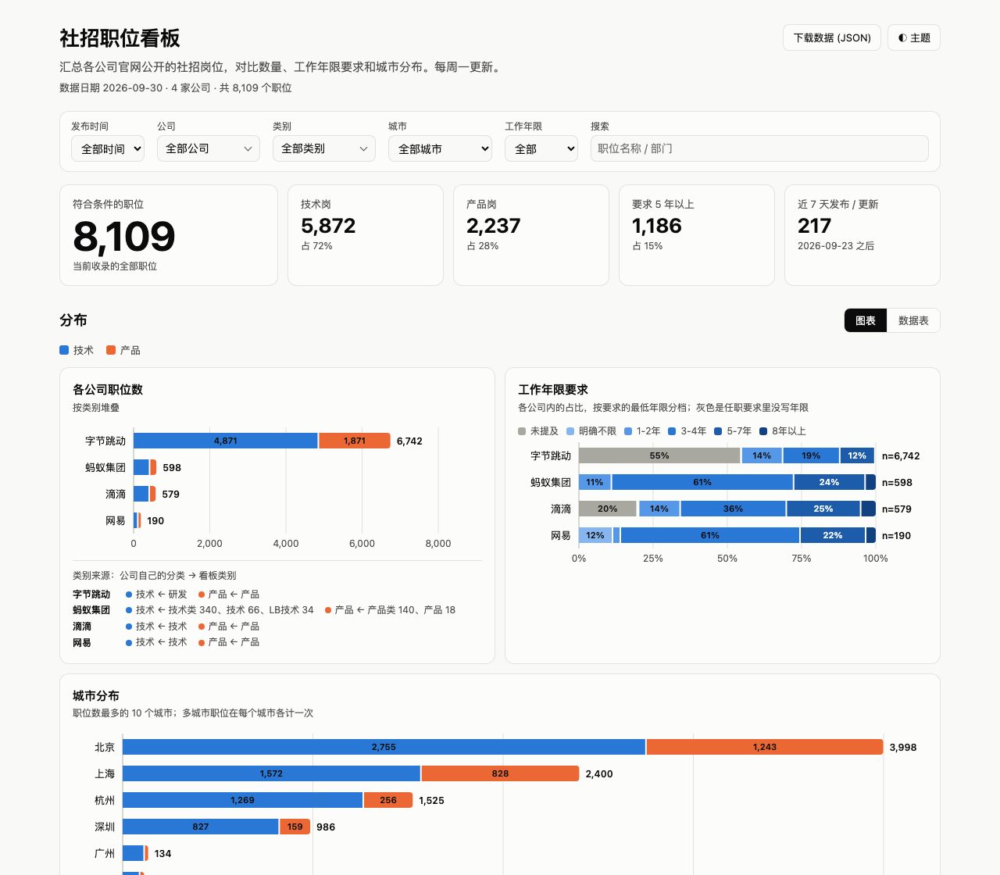
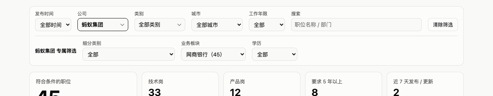

# 社招职位看板

[](LICENSE)

汇总多家互联网公司官网公开的**社招岗位**，对比各家的岗位数量、工作年限要求和城市分布。每周一更新，看板只展示当下在招的岗位。

**在线看板：<https://sigangluo.github.io/cn-tech-jobs/>**

[](https://sigangluo.github.io/cn-tech-jobs/)

## 能做什么

- **总览对比**：各公司岗位数、工作年限要求的分布、城市分布。年限图把「任职要求里没写」和「明确写了不限」分开。
- **筛选**：按发布时间、公司、类别、城市、工作年限、关键词筛选，所有数字和图表随筛选一起变。
- **公司专属筛选**：每家公司的数据维度不一样（有的有二级类别，有的有业务线、部门、学历），选中某一家公司时自动出现它自己的筛选项。
- **看职位详情**：点开任一职位查看职位描述和任职要求，并可以一键跳到该公司官网的对应职位页。
- **类别来源**：每个看板类别（技术 / 产品）由各公司自己的哪些原始分类合成，页面上直接标出。
- **下载数据**：页面底部可以下载每家公司的 CSV，右上角可以下载完整的 JSON。



## 本地运行

```bash
pip install -r requirements.txt

python3 scripts/update.py          # 抓取所有公司并合并，约 6 分钟
python3 scripts/serve.py           # 打开 http://localhost:8000
```

抓取结果在 `data/<公司>/<类别>.csv`；`python3 scripts/update.py --list` 可以看当前接入了哪些公司，`--only <公司>` 只重抓其中几家。

## 新增一家公司

在 `companies/` 下复制 `_template`，填写元信息并实现 `fetch()`，**不需要改其他任何文件**——合并、看板、筛选、页脚说明都会自动带上这家公司。详细步骤见 [.claude/CLAUDE.md](.claude/CLAUDE.md#新增一家公司)。

## 每周更新与发布

```bash
python3 scripts/update.py                # 抓取 + 合并
python3 scripts/publish.py               # 检查要发布的内容（不推送）
python3 scripts/publish.py --push        # 强制推送到 gh-pages 分支
```

`main` 分支只放代码。数据每周都在变，所以由 `publish.py` 单独发布到 `gh-pages` 分支，**这个分支永远只有一个提交**，线上只有当前这一份，旧数据不保留。在 GitHub 的 Settings → Pages 里把 Source 设为 `gh-pages` 分支即可。

## 测试

```bash
python3 -m unittest discover -s tests
```

覆盖工作年限的识别规则（最容易改坏的部分）、年限分档和抓取结果的校验。

## 项目结构

| 路径 | 作用 |
|---|---|
| `companies/<公司>/fetch.py` | 每家公司一个文件：元信息 + 抓取。目录自动发现 |
| `scripts/` | `update.py` 抓取 + 合并入口；`build.py` 合并成看板数据；`publish.py` 发布；`lib/` 是共用代码（统一职位格式、年限识别等） |
| `site/` | 静态看板，没有构建步骤，可部署到任意静态托管 |
| `data/` | 抓取产物（不进 `main`，由 `publish.py` 发布） |
| `tests/` | 单元测试 |

## 数据说明与免责声明

- 职位信息来自各公司官网的公开页面，**版权归原公司所有**，本项目只做整理汇总，仅供参考。职位是否仍在招、具体要求均以官网为准。
- 「工作年限」是从任职要求文本里自动识别的，个别写法特殊的职位可能识别有误。
- 各公司的分类体系不对等，收录范围（比如只收录「技术」「产品」两类）见页面页脚的说明。
- 如果你是相关公司的工作人员，希望移除某些内容，请提 issue，会尽快处理。

## 许可证

代码采用 [MIT](LICENSE)。抓取到的职位数据不在此许可范围内，其版权属于各原公司。
